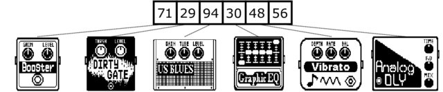
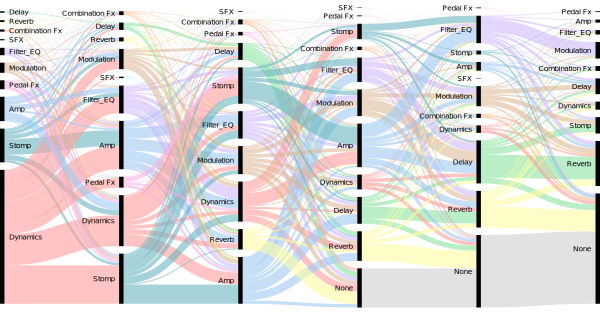

# Zoom G3 Patches

**Zoom G3 Patches** is [a dataset that contains **2161 unique patches** from the Zoom G3 device](data/patches-filtered.csv) (image on right).

The data presented here was extracted around the 2019 from the [Guitar Patches - Zoom G3 and G3X](https://guitarpatches.com/patches.php?unit=G3), a popular audio plugins configurations repository where specialists and amateurs share patches.

A _patch_ to this audio equipment is a sequence of 6 audio plugins. Any of the 117 audio plugins supported for this device can be used in any position. There are `M^R` possible patches if you consider only the audio plugins information. Each audio plugin has a unique identifier. There is a example of a patch from the dataset:
<figure>
	
	<figcaption>
  <p>
    <strong>Above</strong>: A sequence of 6 numbers that represents the patch. Each blocks correspond to the instances of the audio plugins in the position defined in the patch; numbers correspond to the unique identifiers of the audio plugins. 
    <strong>Below</strong>: Corresponding figure representation of the audio plugins. 
  </p>
  <p>
    Image extrated from the dissertation <a href="https://www.researchgate.net/publication/349648078_Dissertacao_-_Sistemas_de_Recomendacao_de_Plugins_de_Audio_para_Producao_Musical">Sistemas de Recomendação de Plugins de Áudio para Produção Musical</a> (Figure 14).
  </p>
  </figcaption>
</figure>


## Some interesting ideias to do with this dataset

**Audio Plugins Recommendation System for Music Production**

  * **Recommends audio plugins from a incomplete patch**:
    * Plugin recommendation on a single position;
    * Plugin recommendation on multiple positions;
  * **Full patch recommendation**;
  * **Plugins positioning in a given patch**: As the audio plugins aplies non linear transformation in the audio, the plugins positioning is important.

A visual representation of the tasks:

<figure>
	
	<figcaption>
    Audio plugins recommendation cases: 
    <ol type="a">
      <li>user selects some audio plugins and requires that the recommender system suggests audio plugins to the missing positions;</li>
      <li>Model recommends all the audio plugins from a patch (model generates a patch);</li>
      <li>user selects 6 audio plugins and the recommender system model defines the audio plugins best positioning.</li>
    </ol>
    <p>
    Image extrated from the dissertation <a href="https://www.researchgate.net/publication/349648078_Dissertacao_-_Sistemas_de_Recomendacao_de_Plugins_de_Audio_para_Producao_Musical">Sistemas de Recomendação de Plugins de Áudio para Produção Musical</a> (Figure 6).
    </p>
  </figcaption>
</figure>

## Files

> TLTR: Check the [Database.ipynb](Database.ipynb) notebook to obtain the files description.

This repository contains:

* `images/`: 
  * Visual representation of the 117 audio plugins. 
  * The file name has in the pattern `<audio plugin id>.png`.
  * The images was extracted from the [Zoom G3 manual](https://www.zoom.co.jp/sites/default/files/products/downloads/pdfs/E_G3_G3X_2.pdf)^1. 
* `data/`:
  * `plugins-categories.csv`: \
     Contains the plugins identifiers, the plugin names and your category. There are 13 plugins categories. See above to more information;
  * `pedalboard-info.csv`: \
     All the entries that the plugin data was extracted;
  * `pedalboards.csv`: \
     All the pedalboards extracted, without data adjustment;
  * `patches-error.csv`: \
     Patches that wasn't possible collect the pedalboard data;
  * `patches-filtered.csv`: \
     **2161 patches** with your id, your and your six audio plugins;
  * `patches-bag-of-words.csv`: \
     **2161 patches** in a bag-of-words encoding;
  * `patches-one-hot-encoding.csv`: \
     **2161 patches** in a one-hot enconding.

^1 **Legal Warning:** Zoom is a trademark of ZOOM Corporation (<www.zoom.co.jp>), registered in the USA and/or other countries. All companies, products and service names used in this work are for identification purposes only and are not intended to infringe the copyright of their respective owners. The use of these names, trademarks and brands does not imply endorsement.

## About the dataset

Check the [Database.ipynb](Database.ipynb) notebook to obtain the files description.

### Details

The 117 audio plugins are distributed in 13 categories by the official Zoom G3 patch editor software (see `data/plugins-categories.csv`). 
The following table shows 11 categories and the number of plugins by category after joining categories with with similar purposes:

<center><strong>Number of audio plugins and their occurrences by category</strong></center>

| **Category**  | **# plugins** | **\# plugins occurrence** |
|---------------|---------------|---------------------------|
| Amp <small>(Original Amp ∪ Amp Modeling)</small>     | 28                                      | 1678                                               |
| Combination Fx                                       | 7                                       | 225                                                |
| Delay                                                | 12                                      | 1069                                               |
| Dynamics                                             | 7                                       | 2451                                               |
| Filter\_EQ                                           | 10                                      | 1140                                               |
| Modulation                                           | 22                                      | 1168                                               |
| None                                                 | 1                                       | 2131                                               |
| Pedal Fx                                             | 4                                       | 248                                                |
| Reverb                                               | 8                                       | 1320                                               |
| SFX                                                  | 3                                       | 40                                                 |
| Stomp <small>(Original Stomp ∪ Stomp Modeling)</small> | 15                                      | 1496                                               |
That table was Number of audio plugins and their occurrences by category

One of the available audio plugins is named `None`: specialists can use it if they do not want a signal transformation in a specific position of the patch. Your visual representation is a funny audio cable: .

Is noteworthy  that the use of audio plugins is imbalanced, the five most commonly used audio  plugins  correspond  to  38.84%  of  the  instances,  namely: `107 - None` (16.43%), `27 - ZNR` to noise reduction (10.08%), `30 - Equalizer` (5.66%), `23 - Compressor` (3.91%) and `71 - Booster` (2.73%).

<figure>
	
	<figcaption>
  <p>
    Distribution of the number of audio plugin contained in the dataset. Listed only plugins whose number of usages is greater than 60.
  </p>
  <p>
    Image extrated and adapted from the dissertation <a href="https://www.researchgate.net/publication/349648078_Dissertacao_-_Sistemas_de_Recomendacao_de_Plugins_de_Audio_para_Producao_Musical">Sistemas de Recomendação de Plugins de Áudio para Produção Musical</a> (Figure 15).
  </p>
  </figcaption>
</figure>


We can see in the following figure some relationship between the audio plugins categories with the plugins positioning in the patch.
In this Sankey Diagram, each grouping of columns on the x axis represents one of the six positions in the patch (the first position is the most left grouping of columns).
The size of each column in the y axis informs the proporsion of the use of audio plugins by the same category in the specific position in the patch.
The category name is next to the corresponding column. 
An edge connects two columns and **indicates the proportion of the left column that is preceded by the right column**.

<figure>
	
	<figcaption>
  <p>
    Sankey Diagram indicating the categories of the audio plugins by position in the patches. Same edge colors for the same source categories.
  </p>
  <p>
    Image extrated from the dissertation <a href="https://www.researchgate.net/publication/349648078_Dissertacao_-_Sistemas_de_Recomendacao_de_Plugins_de_Audio_para_Producao_Musical">Sistemas de Recomendação de Plugins de Áudio para Produção Musical</a> (Figure 16).
  </p>
  </figcaption>
</figure>

By this figure, we can note some relationships between the positioning of categories and the relationships between categories of neighboring positions:
  * The `Dynamics` category corresponds to about 50\% of the audio plugins used in the first position;
  * The `Dynamics` usage is widespread, so that several categories appear after it: a `Dynamics` column precedes several columns;
  * For the first three positions, there is a tendency that after an `Stomp` there is an ` mp`. The same is not true for a `Stomp` in fifth position;
  * A significant proportion of the predecessor categories of `Amp` are `Dynamics` and `Stomp`;
  * Given the standardization of the `None` position (all the `None` are moved to the right), there is always a `None` after a `None`, except at the end of the chain;
  * A `Reverb`, when used, tends to be the last plugin in the effects chain (pedalboard), that is, after a `Reverb` it will most likely appear a `None` or the end of the chain.
\end{itemize}

## Extracting more data

As the data has colected around 2019, if you want to obtain more data, you can do this by following this steps:

### Prepare environment:

1. Create virtualenv: `python3 -m venv venv`
1. Start virtualenv: `source venv/bin/activate`
1. Install dependencies: `python setup.py develop`
1. Maybe requires
    ```
    sudo apt-get update -y
    sudo apt-get install -y python3-dev
    sudo apt-get install -y libxml2-dev libxslt1-dev
    sudo apt-get install -y libssl-dev libffi-dev
    sudo apt install bsdtar
    ```

### Scrap pages

1. Remove the old pedalboards data\
   `rm data/pedalboard-info.csv`
1. Obtain the Zoom G3 and G3X entries from the Guitar Patches: \
   `scrapy runspider scrap.py -o data/pedalboard-info.csv -t csv`

### Scrap and prepare data

Run in the following order:

1. Open the jupyter notebook: \
   `jupyter notebook`
1. **Generates the `data/plugins-categories.csv`** \
   (Optinal) Open and run all: \
   `Processing_data_1_-_audio_plugins.ipynb`
1. **Download all the pedalboard files and generates: `data/patches.csv`,  `data/patches-error.csv`**\
   Open and execute all steps: \
   `Processing_data_2_-_Collect_patches_data.ipynb`
1. **Organize data, removing duplication and moving None plugins to right. Generates `data/patches-filtered.csv`**\
   Open and execute all steps: \
   `Processing_data_3_-_data_transformations`
1. **Generates: `patches-one-hot-encoding.csv` and `patches-bag-of-words.csv`** \
Open and execute all steps: ```Processing_data_3_-_Bag_of_plugins.ipynb```

## About

This dataset is created and firstly used in the [Audio Plugin Recommendation Systems for Music Production](https://ieeexplore.ieee.org/document/8923658) paper. If you interested in using it in a research, please add a reference to this:

```bibtex
@inproceedings{da2019audio,
  title={Audio Plugin Recommendation Systems for Music Production},
  author={da Silva, Paulo Mateus Moura and Mattos, C{\'e}sar Lincoln Cavalcante and de Souza J{\'u}nior, Amauri Holanda},
  booktitle={2019 8th Brazilian Conference on Intelligent Systems (BRACIS)},
  pages={854--859},
  year={2019},
  organization={IEEE}
}
```

If you are interested to the [Audio Plugin Recommendation Systems for Music Production](https://ieeexplore.ieee.org/document/8923658) paper, maybe the dissertation [Sistemas de Recomendação de Plugins de Áudio para Produção Musical](https://www.researchgate.net/publication/349648078_Dissertacao_-_Sistemas_de_Recomendacao_de_Plugins_de_Audio_para_Producao_Musical) would be a good reference. It contains more details about the dataset, the models used and the training processes, but it was wrote in Brazilian Portuguese.